# Youth Secure Check-in

[](LICENSE)
[](https://www.python.org/downloads/)
[](https://flask.palletsprojects.com/)

A secure, flexible check-in/check-out system for youth organizations including Trail Life, scouting groups, churches, schools, and community programs. Features family management, event tracking, QR code checkout, label printing, and comprehensive security controls.

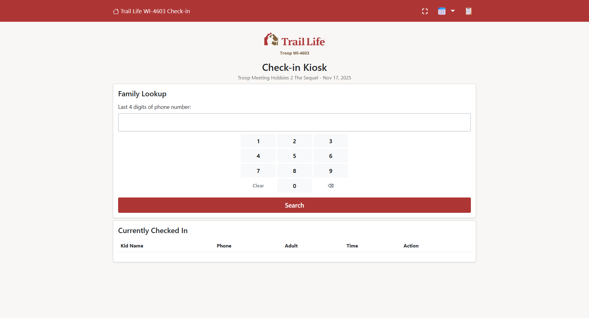

## 🌟 Key Features

### ✅ Check-in Management
- **Quick Check-in**: Fast family lookup by phone number (last 4 digits)
- **Event Selection**: Auto-populated from iCal feeds or manual entry
- **Kid Selection**: Multi-kid check-in with one tap
- **Status Tracking**: Real-time check-in/check-out status with timestamps
- **History View**: Complete check-in history with filtering

### 🔒 Security & Access Control
- **Multiple Authentication Levels**: App password, admin override, developer password
- **Checkout Codes**: QR codes or printed labels for secure pickup
- **Authorized Adults**: Track who can pick up each child
- **Developer Password**: Backup access via environment variable
- **Session Security**: Encrypted session management

### 👨‍👩‍👧‍👦 Family Management
- **Family Records**: Store families with adults and children
- **Group Assignment**: Organize by troop/den/class/group
- **CSV Import/Export**: Bulk import families, export for backup
- **Flexible Import**: Supports multiple CSV column name variations
- **Notes Field**: Track allergies, special needs, emergency info

### 🎨 Customizable Branding
- **Organization Details**: Name, type, group terminology
- **Color Schemes**: Primary, secondary, and accent colors
- **Logo Upload**: PNG, JPG, or SVG logos (auto-sized)
- **Favicon Support**: Custom browser tab icons
- **Setup Wizard**: First-run configuration guide
- **Dark Mode**: Toggle between light and dark themes (persisted in browser)

### 🎫 Checkout Options
- **QR Codes**: Display on screen for mobile scanning
- **Label Printing**: Brother QL series thermal printers
- **Dual Mode**: Support both QR and labels simultaneously
- **Custom Labels**: Three-line configurable text

### 📊 Event Management
- **iCal Import**: Auto-import from Google Calendar, Outlook, etc.
- **Manual Entry**: Create, edit, and delete events directly in the system
- **Bulk Operations**: Clear all events with one click
- **Date Range Control**: Configurable event dropdown (±1 to ±12 months)
- **Event History**: Track attendance across events

### 💾 Backup & Restore
- **Configuration Export**: JSON backup of all settings
- **Configuration Import**: Restore settings from backup
- **Family Export**: CSV export of all family data
- **History Export**: CSV export of all check-in/check-out records
- **Disaster Recovery**: Complete backup/restore workflow

## 🚀 Quick Start

### Docker Deployment (Recommended)

Deploy in 30 seconds with Docker:

```bash
# Download the configuration files
curl -O https://raw.githubusercontent.com/mrcrunchybeans/youth-secure-checkin/master/docker-compose.yml
curl -O https://raw.githubusercontent.com/mrcrunchybeans/youth-secure-checkin/master/.env.docker
mv .env.docker .env

# Start the application
docker-compose up -d

# Access at http://localhost:5000
```

**Try the Demo:**
```bash
curl -O https://raw.githubusercontent.com/mrcrunchybeans/youth-secure-checkin/master/docker-compose.demo.yml
mv docker-compose.demo.yml docker-compose.yml
docker-compose up -d

# Demo login: demo123 / demo2025
# Test families: Phone numbers 555-0101 through 555-0108
```

See **[DOCKER.md](DOCKER.md)** for complete deployment guide.

### Manual Installation

For development or custom deployments:

1. **Prerequisites**: Python 3.10+, pip, Git

2. **Clone and setup**
   ```bash
   git clone https://github.com/mrcrunchybeans/youth-secure-checkin.git
   cd youth-secure-checkin
   python -m venv venv
   venv\Scripts\activate  # Windows
   # source venv/bin/activate  # Linux/Mac
   pip install -r requirements.txt
   ```

3. **Configure**
   ```bash
   cp .env.example .env
   # Edit .env and set SECRET_KEY and DEVELOPER_PASSWORD
   ```

4. **Initialize and run**
   ```bash
   python -c "from app import init_db; init_db()"
   python app.py
   # Open http://localhost:5000
   ```

Complete first-time setup wizard, then start checking in families!

## 📖 Documentation

- **[Docker Guide](DOCKER.md)** - Docker deployment (recommended)
- **[Deployment Checklist](DEPLOYMENT_CHECKLIST.md)** - Production hosting guide
- **[Security Guide](SECURITY.md)** - Security best practices
- **[FAQ](docs/FAQ.md)** - Frequently asked questions
- **[Contributing Guide](CONTRIBUTING.md)** - How to contribute

## 🎯 Use Cases

This system is perfect for:
- **Trail Life USA** troops and outposts
- **Scouting organizations** (BSA, Girl Scouts, etc.)
- **Churches** (children's ministry, youth groups)
- **Schools** (after-school programs, clubs)
- **Community centers** (sports teams, activities)
- **Childcare facilities** (daycare, preschool)
- **Any organization** tracking youth attendance

## 🔧 Configuration

### First-Time Setup Wizard
On first run, you'll complete a 4-step setup wizard:
1. **Organization Details**: Name, type, group terminology
2. **Color Scheme**: Primary, secondary, accent colors
3. **Access Code**: Set the main login password
4. **Event Settings**: Configure event date range

### Admin Panel
Access comprehensive settings at `/admin`:
- **Families**: Add, edit, import, export family records
- **Events**: Import from iCal or create manually
- **Security**: Access codes, checkout codes, label settings
- **Branding**: Logo, favicon, colors, organization details
- **Backup & Restore**: Export/import configuration

## 📸 Screenshots

<details open>
<summary><b>Click to collapse screenshots</b></summary>

### Kiosk & Check-in Experience
| Main Kiosk | Family Selection |
|:---:|:---:|
| 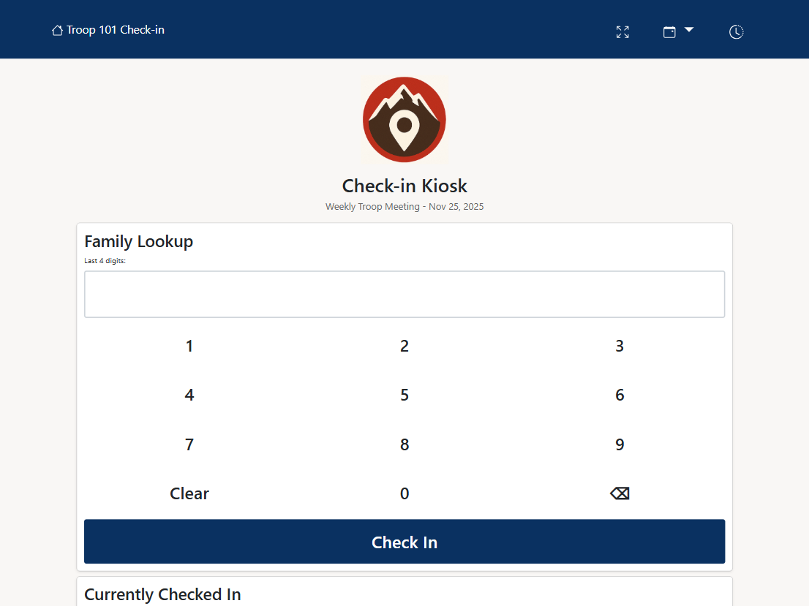 | 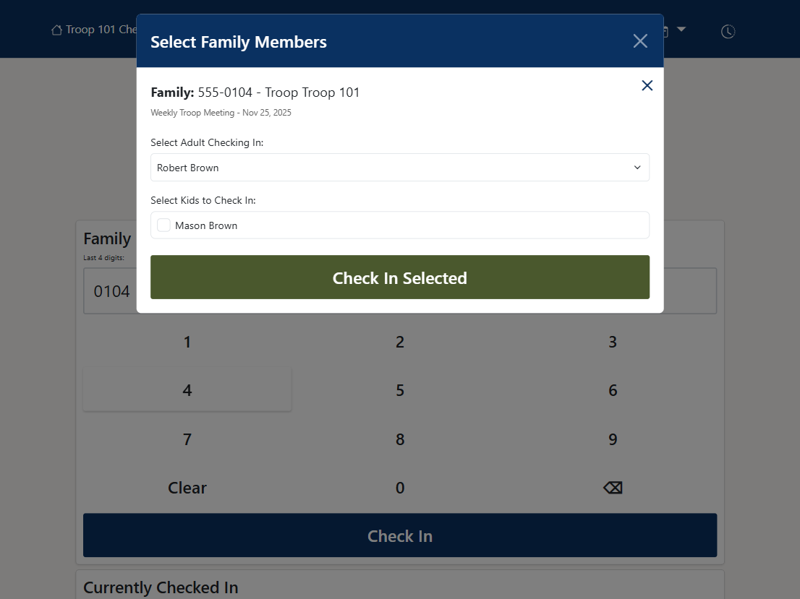 |

| QR Code Checkout | Secure Checkout |
|:---:|:---:|
| 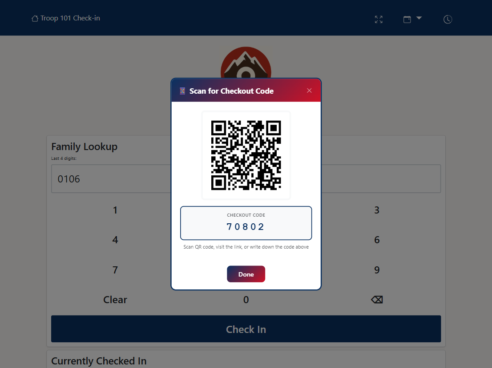 | 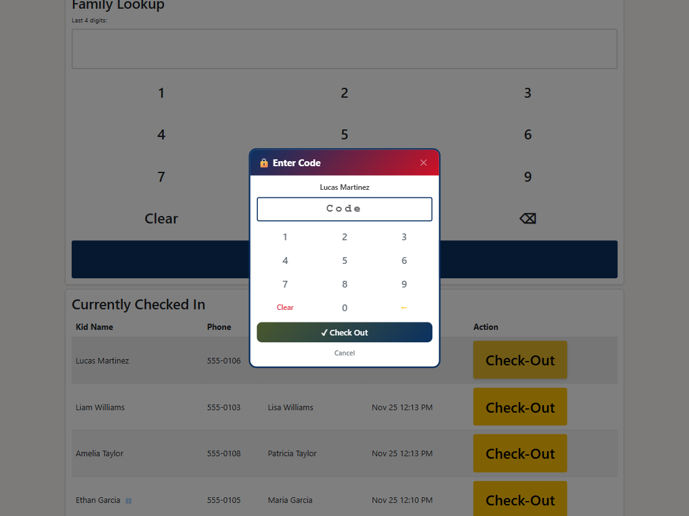 |

### Admin Dashboard & Management
| Admin Dashboard | Event Management |
|:---:|:---:|
| 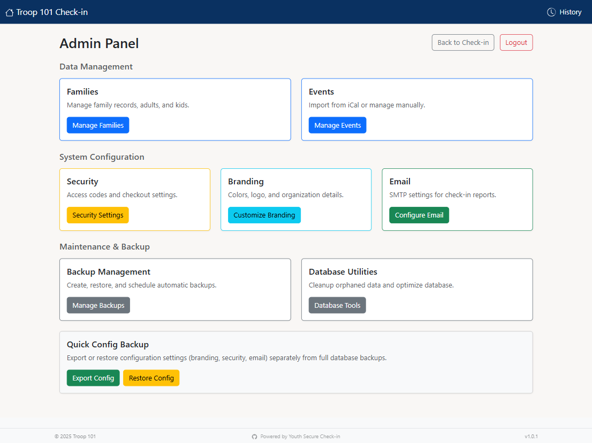 | 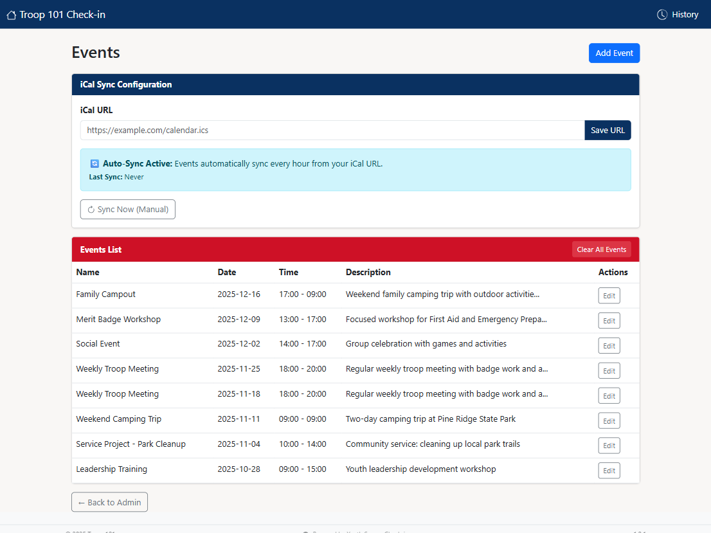 |

| Family Management | Edit Family Details |
|:---:|:---:|
| 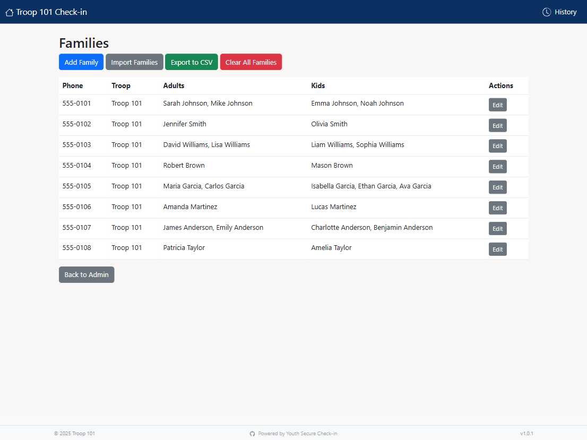 | 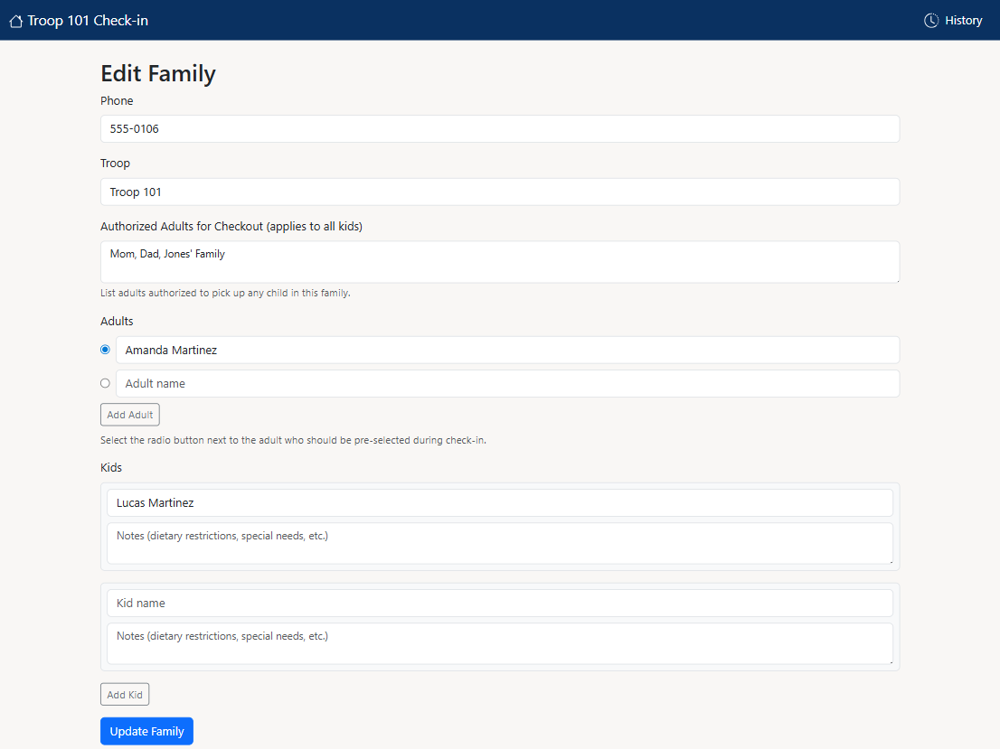 |

### Customization & Reporting
| Branding Settings | Attendance History |
|:---:|:---:|
| 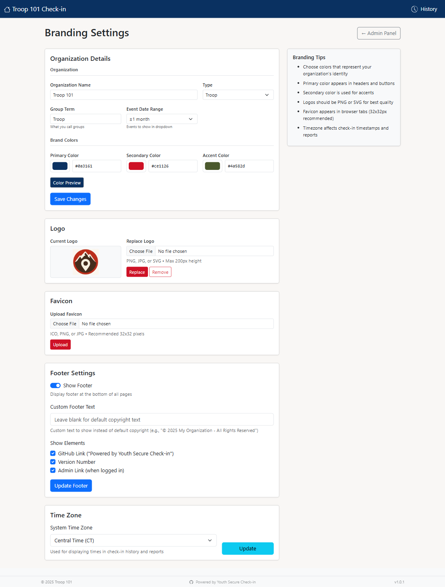 | 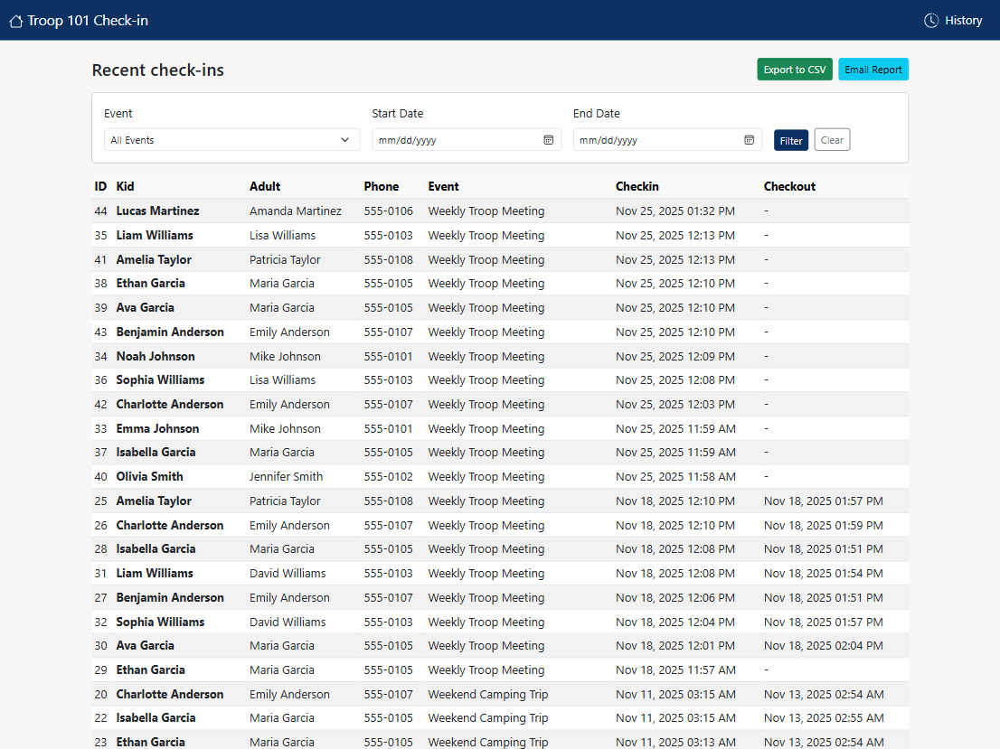 |

</details>

## 🛠️ Technology Stack

- **Backend**: Flask 3.0 (Python web framework)
- **Database**: SQLite (embedded, zero-config)
- **Frontend**: Bootstrap 5.3 + vanilla JavaScript
- **QR Codes**: qrcode library with Pillow
- **Label Printing**: Brother QL series support
- **Calendar Import**: icalendar + pytz
- **CSV Processing**: Native Python csv module

## 📋 Requirements

See [requirements.txt](requirements.txt) for full dependency list:
- Flask==3.0.0
- icalendar==5.0.11
- requests==2.31.0
- qrcode==7.4.2
- Pillow==10.1.0
- python-dotenv==1.0.0
- gunicorn==21.2.0 (for production)

## 🐳 Deployment Options

### Docker (Recommended)
Pull pre-built images from Docker Hub:
```bash
docker-compose up -d
```
See [DOCKER.md](DOCKER.md) for complete guide.

### VPS / Cloud Server
- **DigitalOcean, Linode, Vultr**: Ubuntu + Docker
- **AWS, Google Cloud, Azure**: Container services
- **SSL**: Use Caddy or Cloudflare Tunnel for automatic HTTPS

See [DEPLOYMENT_CHECKLIST.md](DEPLOYMENT_CHECKLIST.md) for hosting guides.

### Platform as a Service
- **Railway**: Docker support with automatic SSL
- **Render**: Docker deploy from GitHub
- **Fly.io**: Global edge deployment
- **Heroku**: Use included Procfile

## 🤝 Contributing

Contributions are welcome! Please:
1. Fork the repository
2. Create a feature branch (`git checkout -b feature/amazing-feature`)
3. Commit your changes (`git commit -m 'Add amazing feature'`)
4. Push to the branch (`git push origin feature/amazing-feature`)
5. Open a Pull Request

## 📄 License

This project is licensed under the MIT License - see the [LICENSE](LICENSE) file for details.

## 🙏 Acknowledgments

- Built for Trail Life WI-4603, adapted for universal use
- Bootstrap for the responsive UI framework
- Flask community for excellent documentation
- All contributors and users providing feedback

## 💬 Support

- **Issues**: [GitHub Issues](https://github.com/mrcrunchybeans/youth-secure-checkin/issues)
- **Discussions**: [GitHub Discussions](https://github.com/mrcrunchybeans/youth-secure-checkin/discussions)
- **Docker Hub**: [mrcrunchybeans/youth-secure-checkin](https://hub.docker.com/r/mrcrunchybeans/youth-secure-checkin)

## 🔐 Security

For security concerns, please see [SECURITY.md](SECURITY.md) or open a private security advisory on GitHub.

---

**Made with ❤️ for youth organizations everywhere**
